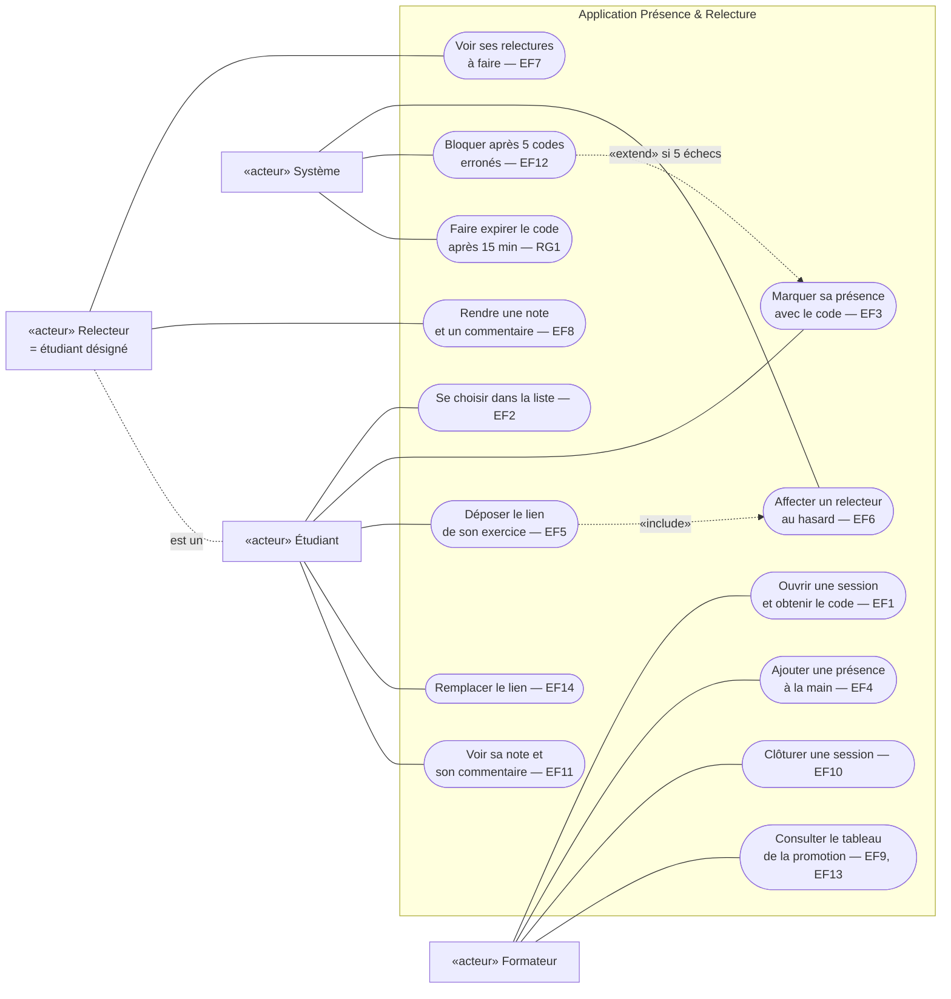

# D1 — Cas d'utilisation

Mermaid n'a pas de diagramme de cas d'utilisation natif : les acteurs sont des rectangles «acteur», les cas d'utilisation (ovales) dans le cadre du système. Chaque cas renvoie à son exigence `EFx`.

**Lecture :**
- Le **relecteur n'est pas un acteur à part** : c'est un étudiant désigné par le système pour relire un exercice précis (voir cahier des charges §2). Le lien pointillé « est un » le rappelle.
- Déposer un exercice **inclut** l'affectation d'un relecteur (RG8) ; marquer sa présence est **étendu** par le blocage après cinq erreurs (RG5).
- Aucun cas « se connecter » : pas d'authentification (Q1).
