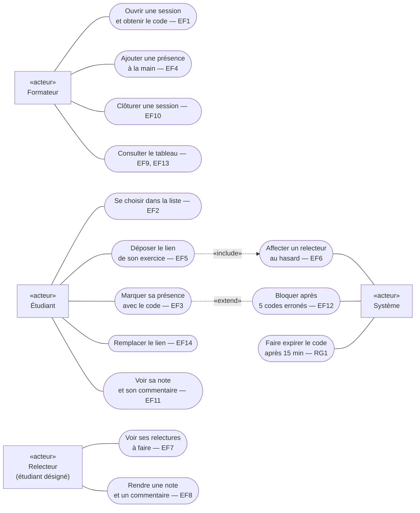

# D1 — Cas d'utilisation

Mermaid n'a pas de diagramme de cas d'utilisation natif. Conventions : les **acteurs** sont des rectangles «acteur», les **cas d'utilisation** sont les ovales — tous appartiennent au système « Application Présence & Relecture ». Chaque cas renvoie à son exigence `EFx`. Les acteurs humains sont à gauche, l'acteur **Système** (traitements automatiques) à droite.

**Lecture :**
- Le **relecteur n'est pas un acteur à part** : c'est un étudiant désigné par le système pour relire un exercice précis (voir cahier des charges §2). Il est dessiné séparément parce que ses cas d'utilisation n'ont de sens que dans cet état.
- « Déposer le lien » **inclut** toujours l'affectation d'un relecteur (RG8) : flèche «include» de EF5 vers EF6.
- « Bloquer après 5 codes erronés » **étend** « Marquer sa présence » (RG5), seulement après 5 échecs : la relation «extend» va de EF12 vers EF3 (le trait pointillé est sans pointe pour garder un rendu lisible).
- Aucun cas « se connecter » : pas d'authentification (Q1).
