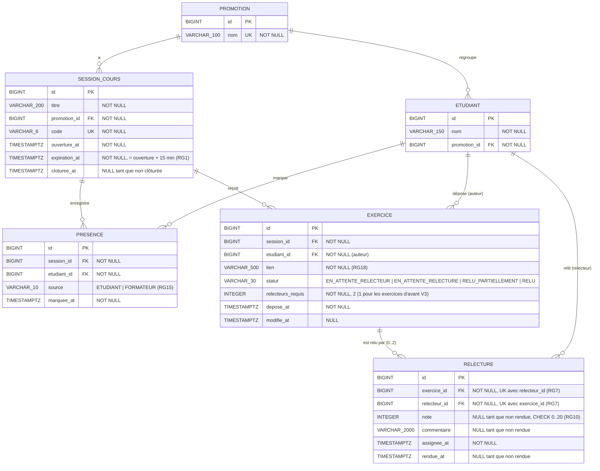

# D2 — Modèle de données

Ce diagramme correspond **exactement** aux migrations Flyway de `backend/src/main/resources/db/migration/` (V1 + V3). **v2 — conséquence du changement de besoin de l'étape 3 :** un exercice est relu par deux pairs (migration V3). Toute évolution du schéma passe par une nouvelle migration **et** une mise à jour de ce fichier dans le même commit.

## Contraintes portées par la base

| Contrainte | Règle |
|---|---|
| `UNIQUE (session_id, etudiant_id)` sur `presence` | RG3 — une seule présence par session |
| `UNIQUE (session_id, etudiant_id)` sur `exercice` | RG12 — un seul exercice par session |
| `UNIQUE (exercice_id, relecteur_id)` sur `relecture` (V3, remplace `UNIQUE (exercice_id)` de V1) | RG7 v2 — deux relecteurs **différents** par exercice |
| `UNIQUE (code)` sur `session_cours` | RG4 — un code désigne une seule session |
| `CHECK (source IN ('ETUDIANT','FORMATEUR'))` | RG15 |
| `CHECK (note BETWEEN 0 AND 20)` | RG10 |
| `CHECK (statut IN (...))` (V3 ajoute `RELU_PARTIELLEMENT`) | D4 — cycle de vie d'un exercice |
| `CHECK (relecteurs_requis BETWEEN 1 AND 2)` (V3) | RG7 v2, H13 — 1 pour les exercices déposés avant le changement |

**Choix de modélisation :**
- La table s'appelle `session_cours` et non `session`, mot réservé ou ambigu dans plusieurs SGBD.
- Pas de table `relecteur` ni `formateur` : le relecteur est un étudiant (`relecture.relecteur_id → etudiant.id`), le formateur n'est pas identifié (Q1, cahier des charges §3).
- Une relecture est créée **au moment de l'affectation** (note et `rendue_at` à `NULL`) ; elle est « rendue » quand `rendue_at` est renseigné. C'est ce qui permet de compter les relectures en attente (RG21).
- La note retenue (RG22) et la moyenne (RG17) ne sont **pas stockées** : elles sont calculées à la demande à partir de `relecture.note`.
- `relecteurs_requis` porte la règle « à partir de maintenant » (H13) : un exercice relu par un seul pair avant le changement garde sa note définitive.
- Le compteur de codes erronés (RG5) n'est pas en base : il est gardé en mémoire (cahier des charges H10).
