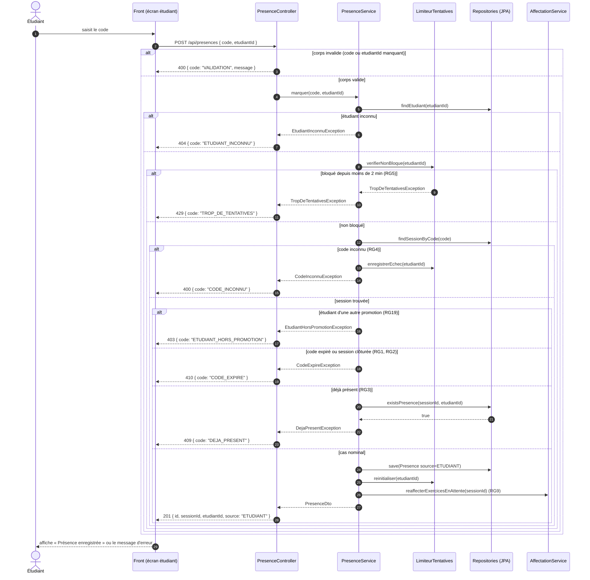

# D3 — Séquence : marquer sa présence

Opération imposée `POST /api/presences { code, etudiantId }`. Chaque branche d'erreur correspond à un code HTTP et à un `code` d'erreur du contrat (`api/contrat.yaml`). Les vérifications sont faites **dans cet ordre** par le service.

## Correspondance avec le contrat

| Cas | HTTP | `code` d'erreur | Règle |
|---|---|---|---|
| Présence enregistrée | **201** | — | EF3 |
| Champ manquant | **400** | `VALIDATION` | B4 |
| Code inconnu | **400** | `CODE_INCONNU` | RG4 |
| Étudiant hors promotion | **403** | `ETUDIANT_HORS_PROMOTION` | RG19 |
| Étudiant inconnu | **404** | `ETUDIANT_INCONNU` | H9 |
| Déjà présent | **409** | `DEJA_PRESENT` | RG3 |
| Code expiré / session clôturée | **410** | `CODE_EXPIRE` | RG1, RG2 |
| Cinq erreurs consécutives | **429** | `TROP_DE_TENTATIVES` | RG5 |
