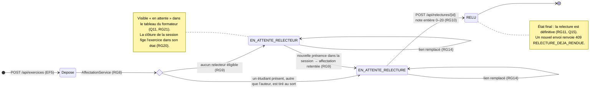

# D4 — États-transitions : cycle de vie d'un exercice (bonus)

La colonne `exercice.statut` (D2) prend exactement les trois valeurs ci-dessous.

| État (`statut`) | Signification | Remplacer le lien ? | Rendre une note ? |
|---|---|---|---|
| `EN_ATTENTE_RELECTEUR` | Déposé, aucun relecteur disponible | Oui (si session non clôturée) | Non, aucune relecture n'existe |
| `EN_ATTENTE_RELECTURE` | Relecteur assigné, relecture non rendue | Oui (si session non clôturée) | Oui (si session non clôturée) |
| `RELU` | Note et commentaire rendus — définitif | Non → `409` | Non → `409 RELECTURE_DEJA_RENDUE` |

« Déposé » n'est pas un statut persistant : l'affectation a lieu dans la même transaction que le dépôt, la réponse `201 { id, statut }` renvoie donc directement `EN_ATTENTE_RELECTURE` ou `EN_ATTENTE_RELECTEUR`.
