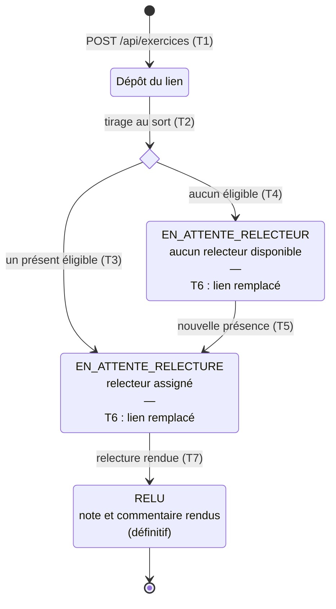

# D4 — États-transitions : cycle de vie d'un exercice (bonus)

La colonne `exercice.statut` (D2) prend exactement les trois valeurs `EN_ATTENTE_RELECTEUR`, `EN_ATTENTE_RELECTURE` et `RELU`.

## Transitions

| Réf | De → vers | Déclencheur | Condition / effet | Règle |
|---|---|---|---|---|
| T1 | début → Dépôt du lien | `POST /api/exercices` | Lien valide, un seul dépôt par session, session non clôturée | EF5 · RG12 · RG13 · RG18 |
| T2 | Dépôt → choix | Automatique, même transaction | Tirage au sort parmi les étudiants présents à la session, auteur exclu | EF6 · RG8 |
| T3 | choix → `EN_ATTENTE_RELECTURE` | Au moins un présent éligible | Une ligne `relecture` est créée (note `NULL`) | RG7 · RG8 |
| T4 | choix → `EN_ATTENTE_RELECTEUR` | Aucun présent éligible | Aucune relecture créée | RG9 · H4 |
| T5 | `EN_ATTENTE_RELECTEUR` → `EN_ATTENTE_RELECTURE` | Nouvelle présence enregistrée dans la session | L'affectation est retentée | RG9 |
| T6 | transition **interne** (l'exercice reste dans son état, écrite dans la case) | `PUT /api/exercices/{id}` | Remplacement du lien si session non clôturée ; le statut ne change pas | EF14 · RG14 |
| T7 | `EN_ATTENTE_RELECTURE` → `RELU` | `POST /api/relectures/{id}` | Note entière 0–20 ; **état final**, un second envoi renvoie `409 RELECTURE_DEJA_RENDUE` | EF8 · RG10 · RG11 |

## Ce qui est possible dans chaque état

| État (`statut`) | Remplacer le lien ? | Rendre une note ? | Dans le tableau du formateur |
|---|---|---|---|
| `EN_ATTENTE_RELECTEUR` | Oui (si session non clôturée) | Non, aucune relecture n'existe | Compté dans `exercicesEnAttente` de l'auteur (Q11) |
| `EN_ATTENTE_RELECTURE` | Oui (si session non clôturée) | Oui (si session non clôturée) | Compté dans `exercicesEnAttente` de l'auteur et `relecturesEnAttente` du relecteur (RG21) |
| `RELU` | Non → `409 RELECTURE_DEJA_RENDUE` | Non → `409 RELECTURE_DEJA_RENDUE` | La note entre dans la `moyenne` de l'auteur (RG17) |

**Remarques :**
- « Dépôt du lien » est un état **transitoire**, jamais enregistré : l'affectation a lieu dans la même transaction que le dépôt, la réponse `201 { id, statut }` renvoie donc directement `EN_ATTENTE_RELECTURE` ou `EN_ATTENTE_RELECTEUR`.
- La **clôture** de la session (EF10) n'est pas un état de l'exercice : elle fige l'exercice dans son état courant (RG20). Un exercice clôturé en attente reste visible « en attente » dans le tableau (Q11).
