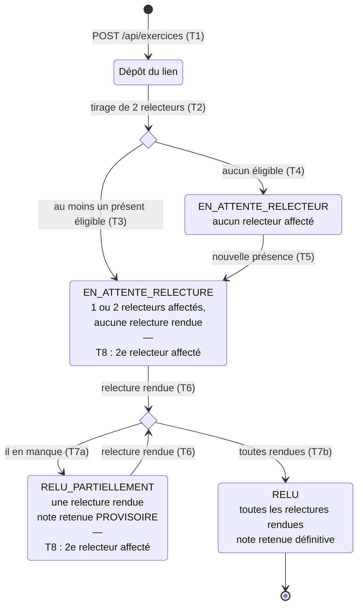

# D4 — États-transitions : cycle de vie d'un exercice (bonus)

**Version 2 — conséquence du changement de besoin de l'étape 3** : chaque exercice est relu par deux pairs, la note retenue est la moyenne des relectures rendues, provisoire tant qu'il en manque une. Nouvel état `RELU_PARTIELLEMENT`.

La colonne `exercice.statut` (D2) prend exactement les quatre valeurs `EN_ATTENTE_RELECTEUR`, `EN_ATTENTE_RELECTURE`, `RELU_PARTIELLEMENT` et `RELU`.

## Transitions

| Réf | De → vers | Déclencheur | Condition / effet | Règle |
|---|---|---|---|---|
| T1 | début → Dépôt du lien | `POST /api/exercices` | Lien valide, un seul dépôt par session, session non clôturée | EF5 · RG12 · RG13 · RG18 |
| T2 | Dépôt → choix | Automatique, même transaction | Tirage **sans remise** de 2 relecteurs parmi les présents, auteur exclu | EF6 · RG7 · RG8 |
| T3 | choix → `EN_ATTENTE_RELECTURE` | Au moins un présent éligible | Une ou deux lignes `relecture` créées (note `NULL`) | RG7 · RG8 · H15 |
| T4 | choix → `EN_ATTENTE_RELECTEUR` | Aucun présent éligible | Aucune relecture créée | RG9 · H4 |
| T5 | `EN_ATTENTE_RELECTEUR` → `EN_ATTENTE_RELECTURE` | Nouvelle présence dans la session | L'affectation est retentée | RG9 |
| T6 | → choix | `POST /api/relectures/{id}` | Note entière 0–20 ; chaque relecture est définitive (`409` au second envoi) | EF8 · RG10 · RG11 |
| T7a | choix → `RELU_PARTIELLEMENT` | Il reste une relecture requise non rendue | La note retenue existe mais est **provisoire** | RG22 · RG23 |
| T7b | choix → `RELU` | Toutes les relectures requises sont rendues | Note retenue = moyenne, **définitive** ; état final | RG22 · RG23 |
| T8 | transition **interne** (écrite dans la case) | Nouvelle présence dans la session | Le second relecteur manquant est affecté ; le statut ne change pas | RG9 · H15 |

## Ce qui est possible dans chaque état

| État (`statut`) | Rendre une note ? | Note retenue | Dans le tableau du formateur |
|---|---|---|---|
| `EN_ATTENTE_RELECTEUR` | Non, aucune relecture n'existe | aucune | `exercicesEnAttente` de l'auteur (Q11) |
| `EN_ATTENTE_RELECTURE` | Oui, par chaque relecteur affecté (si session non clôturée) | aucune | `exercicesEnAttente` de l'auteur, `relecturesEnAttente` des relecteurs |
| `RELU_PARTIELLEMENT` | Oui, par le relecteur qui n'a pas rendu | **provisoire** | `exercicesEnAttente` de l'auteur ; la moyenne est marquée provisoire |
| `RELU` | Non → `409 RELECTURE_DEJA_RENDUE` | définitive | entre dans la `moyenne` de l'auteur (RG17) |

**Remarques :**
- « Dépôt du lien » est un état **transitoire**, jamais enregistré : la réponse `201 { id, statut }` renvoie directement `EN_ATTENTE_RELECTURE` ou `EN_ATTENTE_RELECTEUR`.
- Un exercice déposé **avant** le changement de besoin a `relecteurs_requis = 1` (H13) : sa relecture unique le fait passer directement à `RELU`.
- La **clôture** de la session (EF10) n'est pas un état de l'exercice : elle fige l'exercice dans son état courant (RG20).
- v1 → v2 : la transition interne « lien remplacé » a disparu avec EF14, sacrifiée (issue #18).
